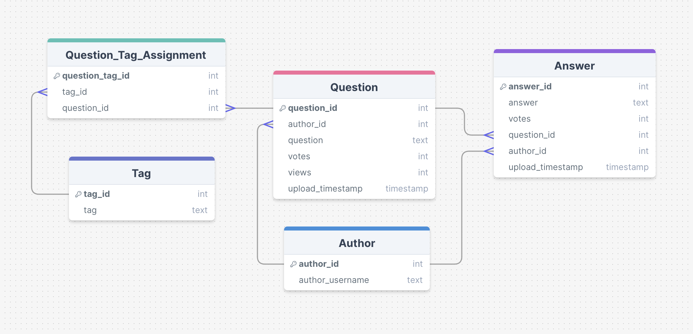
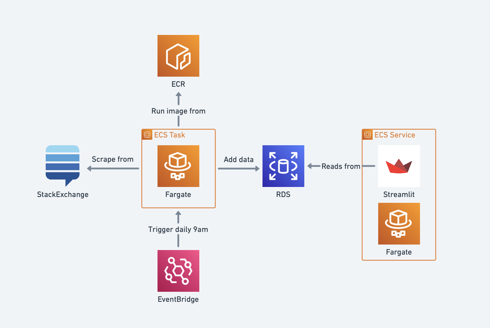

# Sigma Labs Coursework: StackExchange History Page

## Pipeline:
ETL pipeline to web scrape the StackExchange historical page for the latest 50 questions and update the database. 
This has been automated on the cloud to be triggered at 9am every morning. 

#### Command to run locally:
* Run ```python3 pipeline.py``` from the pipeline directory.  


## Dashboard: 
Streamlit dashboard to display analytical data about StackExchange questions on the history page. 

#### Command to run locally:
* Run ```streamlit run dashboard.py``` from the dashboard directory. 


## Technologies used: 
- AWS ECS Task to run the pipeline on the cloud.
- AWS EventBridge scheduler to automate the running of the ECS task at 9am every morning.
- AWS RDS database to store scraped data, for future use by the dashboard.
- Streamlit to create interactive dashboard. 
- AWS ECS service to run the dashboard continuously.
- Docker to containerize pipeline and dashboard code.
- Terraform to create code as an infrastructure. 


## Entity-Relationship Diagram 

The schema for the RDS is in 3NF. 

## Architecture Diagram
